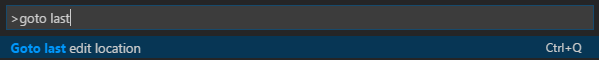

# vscode-goto-last-edit-location
Visual Studio Code extension that provides the "Goto last edit location" command.

## Installation
Download the [extension](https://github.com/krizzdewizz/vscode-goto-last-edit-location/raw/master/dist/goto-last-edit-location-0.0.1.vsix) and run

`code goto-last-edit-location-0.0.1.vsix`

By pressing `F1` you should now see 'Goto last edit location' command in the drop down:

Press `CTRL+Q` to invoke the command.

## Development setup
- run `npm install` inside the project folder
- open VS Code on the project folder

## Build
- run `npm run compile`.

## Package
- run `vsce package` and move the created `.vsix` to the `dist` folder. If a new version is published, don't forget to update this documentation.

