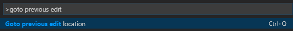
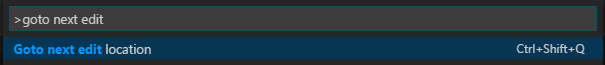

# vscode-goto-last-edit-location
Visual Studio Code extension that provides the "Goto previous/next edit location" commands.

After installing and pressing `F1`, you should see the 'Goto last edit location' command in the drop down:

Press `CTRL+Q` to invoke the command.

Press `CTRL+SHIFT+Q` to invoke the command.

## Release Info
v0.3.0
- Implemented previous/next functionality (`CTRL-Q`/`CTRL+SHIFT-Q`)
- Maximum history items are 1000 by default and 2 at a minimum (use setting `gotoLastEditLocation.maxLocations` to change the limit)

v0.2.0
- Changed keybinding to `CTRL+Q` on Mac ([pull request](https://github.com/krizzdewizz/vscode-goto-last-edit-location/pull/1))
- Changed keybinding to be always active

v0.1.0
- Initial release

## Development setup
- run `npm install` inside the project folder
- open VS Code on the project folder

## Build
- run `npm run compile`.

## Package
- run `vsce package`.

